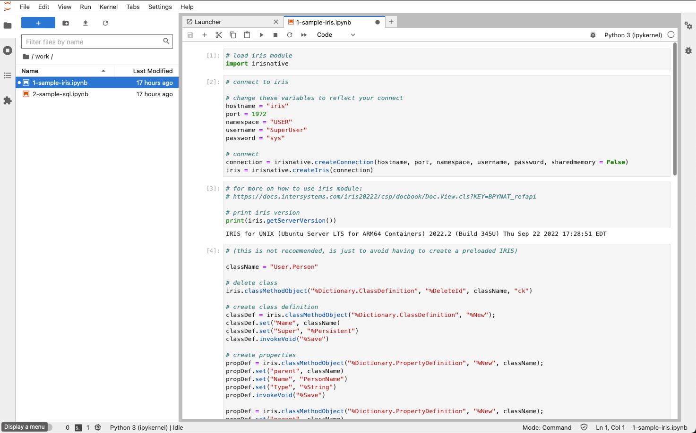

# Jupyter + InterSystems IRIS Module

Just run `docker-compose up -d` and you are ready to go. To stop you can do either `docker-compose stop` or `docker-compose down` (the latter eliminates the containers)

Jupyter ([image](https://github.com/OneLastTry/jupyter-iris-image))

Pre-loaded modules:

- matplotlib
- pandas
- xmltodict
- ipython
- IRIS Python DB-API [documentation](https://docs.intersystems.com/iris20222/csp/docbook/Doc.View.cls?KEY=BTPI_pyapi)

Access: [http://localhost:4200](http://localhost:4200)
- **Password:** admin

InterSystems IRIS _(do not forget to login and change the password)_

Access: [http://localhost:9092/csp/sys/UtilHome.csp](http://localhost:9092/csp/sys/UtilHome.csp)

- **Username:** SuperUser
- **Password:** SYS

There are a couple of examples on how to use IRIS within the notebook inside the **work** directory and the directory **workspace** is mapped to your local environment, therefore your notebook files will be persisted.

